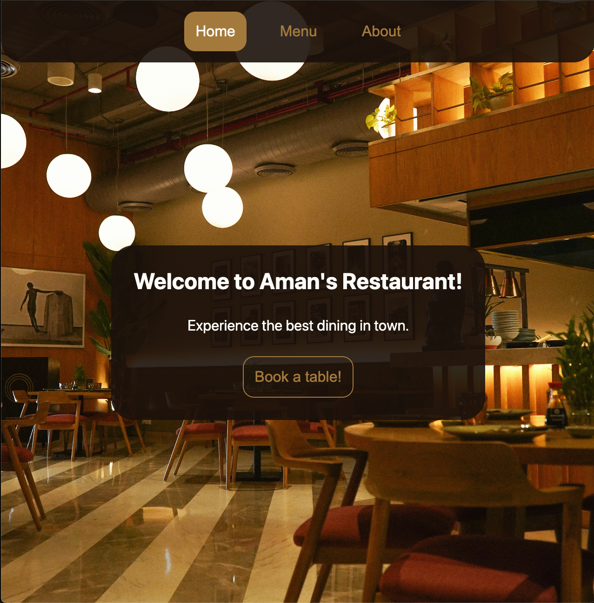

# Restaurant Page 🍽️

A dynamically generated restaurant homepage using JavaScript, HTML, CSS, and Webpack. Demonstrates DOM manipulation, modular architecture, and tabbed navigation.

## 🚀 Try it out



## ✨ Features

- **Dynamic Tab Content** – Home, Menu, and Contact sections are generated entirely via JavaScript modules.
- **Tabbed Navigation** – Seamless switching between “Home”, “Menu”, and “Contact” without page reloads.
- **Webpack Bundling** – ES6+ support, asset management (images, CSS), and hot reloading during development.
- **Responsive Layout** – Built with CSS Grid & Flexbox.
- **GitHub Pages Ready** – Deployment steps included for easy publishing via a `gh-pages` branch.

## 🛠️ Installation

1. Ensure you have Node.js and npm installed.
2. Clone the repo and navigate into it
   ```bash
   git clone https://github.com/theamanali/restaurant-page.git
   cd restaurant-page
   ```
3. Install dependencies
   ```bash
   npm install
   ```
4. Start development server
   ```bash
   npm start
   ```
5. Open in your browser: [http://localhost:8080](http://localhost:8080)

## 🧰 Technologies Used

- **HTML5** – Semantic markup
- **CSS3** – Flexbox & Grid layouts, responsive styling
- **JavaScript (ES6+)** – Modules, DOM manipulation
- **Webpack** – Bundling, loaders, dev server

## 💳 Credits

- **The Odin Project** – Project specification & guidance
- **Image Credits**
  - [Hermes Rivera](https://unsplash.com/@hermez777) on Unsplash
  - [Madie Hamilton](https://unsplash.com/@mham3816) on Unsplash
  - [Cliffer Rebelo](https://unsplash.com/@cliffer14) on Unsplash
  - [Brett Wharton](https://unsplash.com/@brettwharton) on Unsplash
  - [Chad Montano](https://unsplash.com/@briewilly) on Unsplash

## 📄 License

This project is licensed under the **MIT License**. See the [LICENSE](LICENSE) file for details.
